## &rarr; **Testing**

**

 Testing Documentation
**
  - [Testing user stories](#testing-user-stories)
  - [Manual function testing](#manual-function-testing)
  - [Validator checks](#validator-checks)
  - [Audits](#audits)
  - [Responsive Design](#responsive-design)
  - [Additional Testing](#additional-testing)
  - [Bugs](#bugs)

---

#### Testing user stories

Testing my site member's <u>key priorities</u>:

**1. A Simple, user-friendly site that is easy to navigate**
 - Site includes a main navbar featuring a dropdown side nav, with same and different page navigation.
 
- Navigation menu is fixed so is always visible to the user.
- Brand logo directs the user back to the homepage from anywhere on the site.

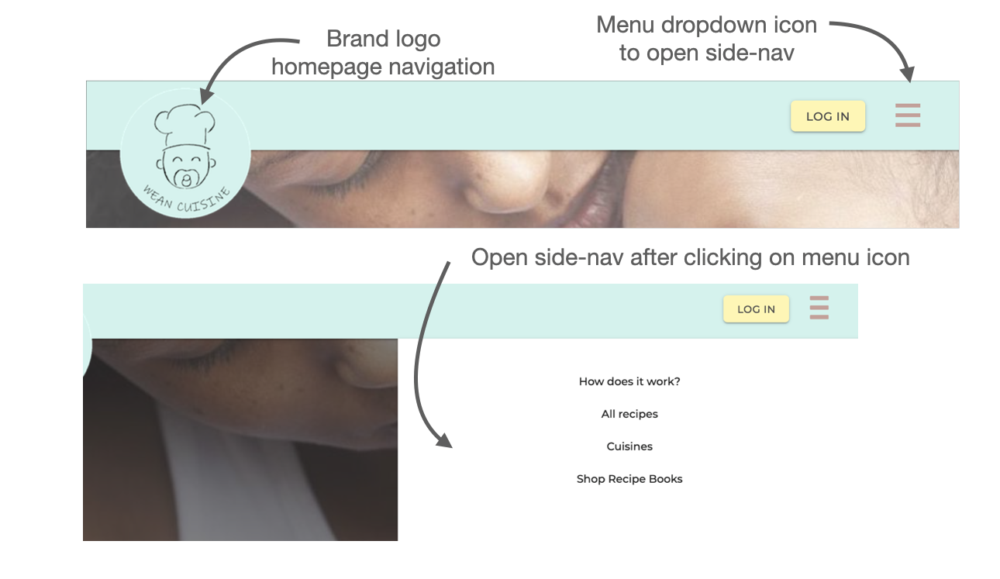

- 404 Error page: I decided to create a custom 404.html page for my user so if they are directed to a non-existent domain, they are presented with an appealing page and an easy navigation button back to the homepage.

  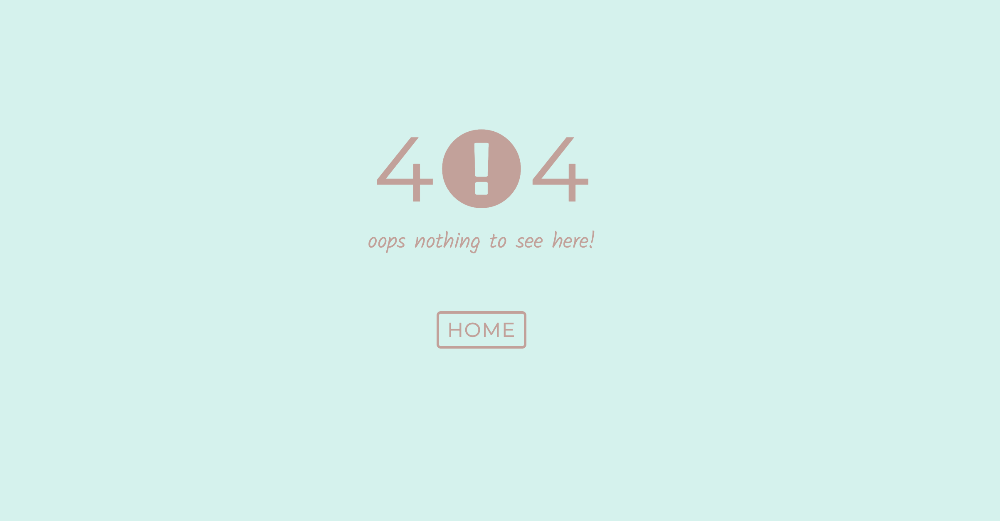
 
**2. Ability to register and an easily accessible button to 'Log in’**

- Clear login button visible on the navbar as soon as the user enters the site.
  - As the navbar is repeated on all pages of the site, the user can log in from any page.
  - If a user is logged in, the button will display 'log out'.

  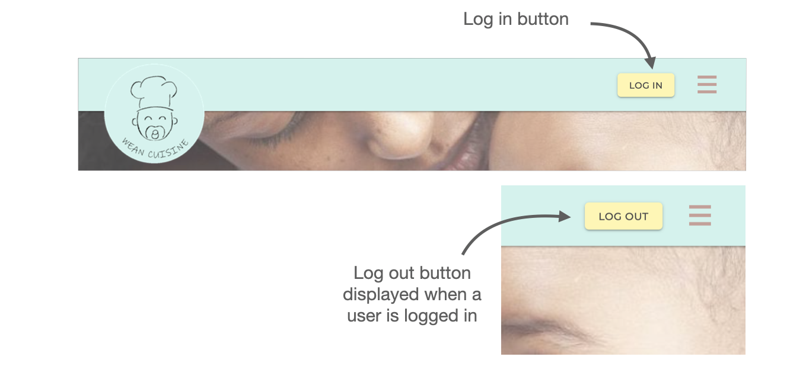

- After clicking the log in button, the user is presented with a modal containing two tabs, giving the user an option to log in or register.
  - Validation is included in the input fields to let the user know if their input is valid through colour formatting.

  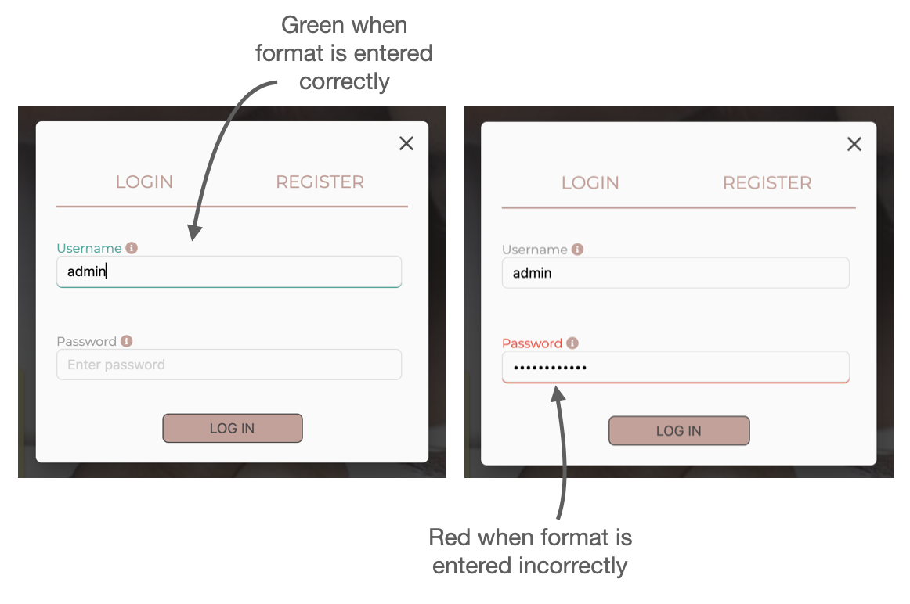

  - Recognisable info icon with tooltip to let the user know which characters can be used.

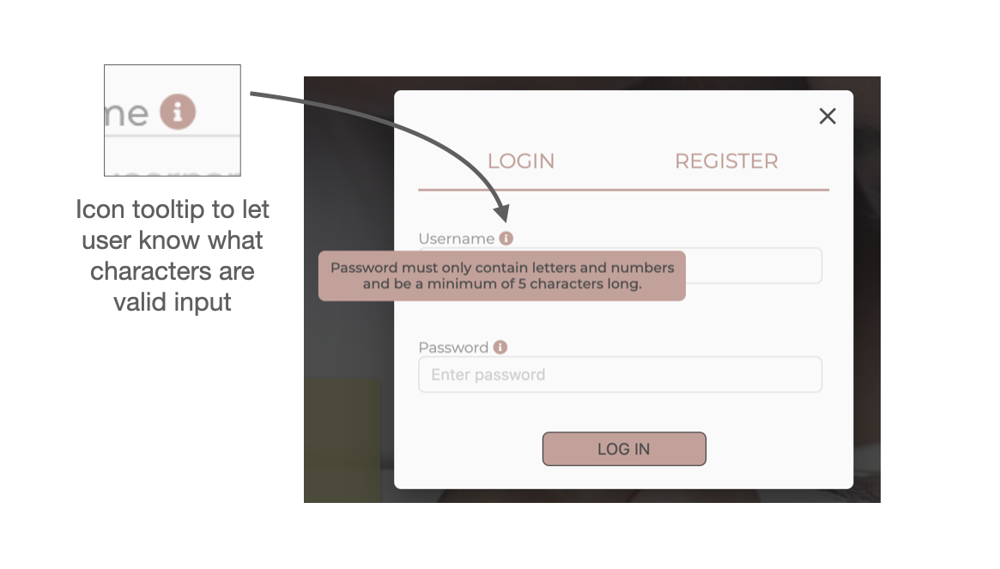

- User responses include notifying the user of any errors or success:
  - Errors are shown below password in modal
  - Success messages presented as a toast after the modal closes.

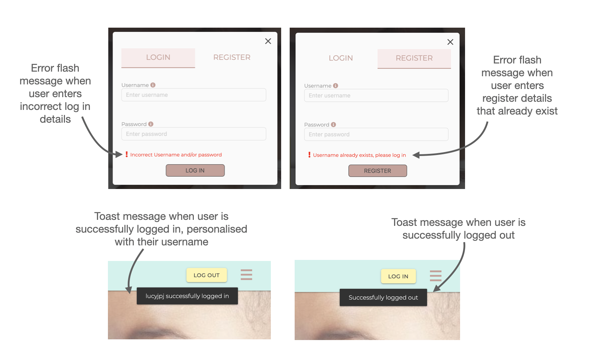

- After logging in or registering the user will have the option to add, edit, and delete their own recipes.

**3. Explore recipes posted by others**

- ‘Explore recipes’ button visible on the callout section as soon as the user enters the site. 
- Navigation-link to recipes also included in the dropdown menu.

    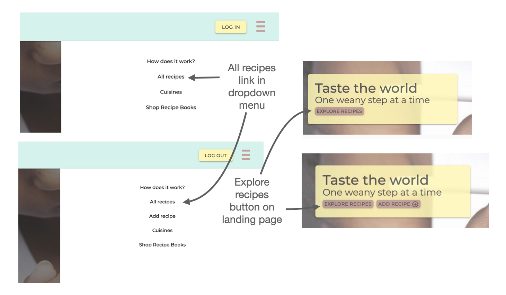

- The recipe page contains recipe cards displaying recipe image, recipe name, cuisine, and who the recipe was created by.

    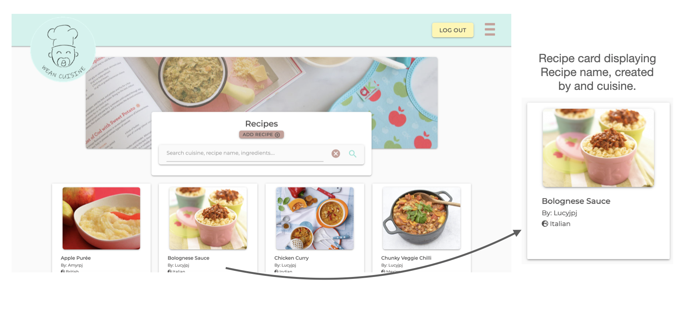

- The user can click onto a recipe card to direct them to the view recipe page which provides more details including age range, serving, time, food course, ingredients, and method.

    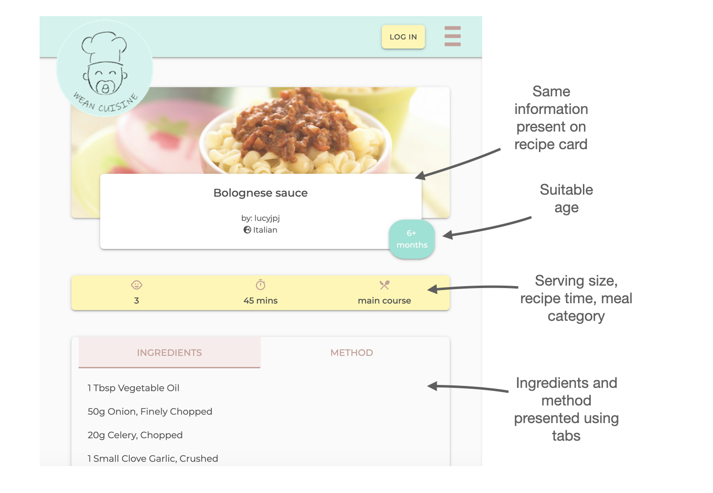

**4. Clear recipe categorisation and search bar to allow quick browsing**

- Link in the dropdown menu to the page displaying cuisine categories.

- There is also a Carousel on the homepage which takes the user to the specific cuisine they click on.

  

- Once on the cuisine page the user can click on a cuisine card to view all recipes within that category.

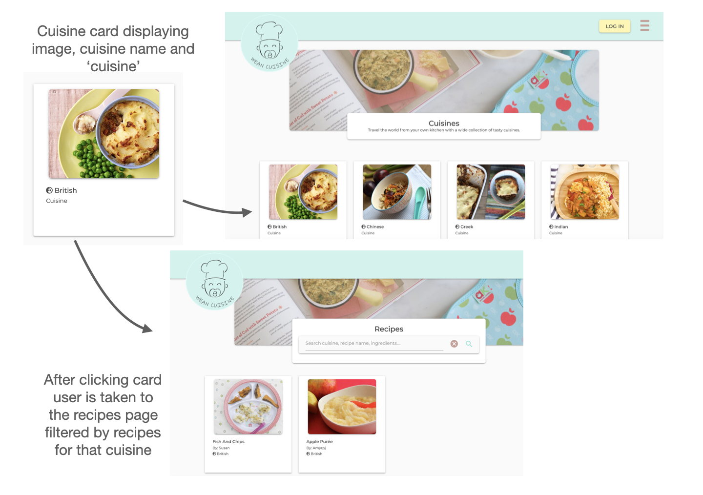

- Search bar to allow the user to search for recipes using keywords. The search bar is set up to filter recipes based on cuisine name, recipe name, and ingredients.
   - Search bar input label to give user ideas of what to query by.

    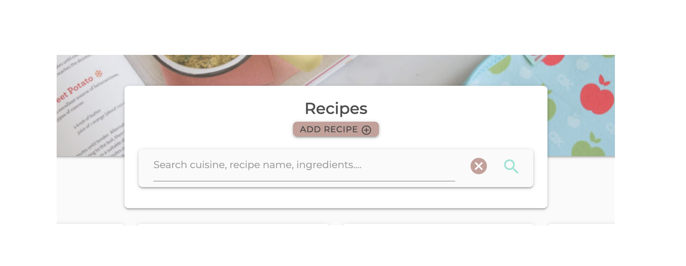

**5. Option to add, edit and delete own recipes**
- When the user is logged in the ‘add recipe’ button is visible to the user on the first view of the site. The link is also accessible via the dropdown menu.

- When the user clicks 'Add recipe' they are taken to the add recipe page which presents the user with a template of inputs to fill out.

     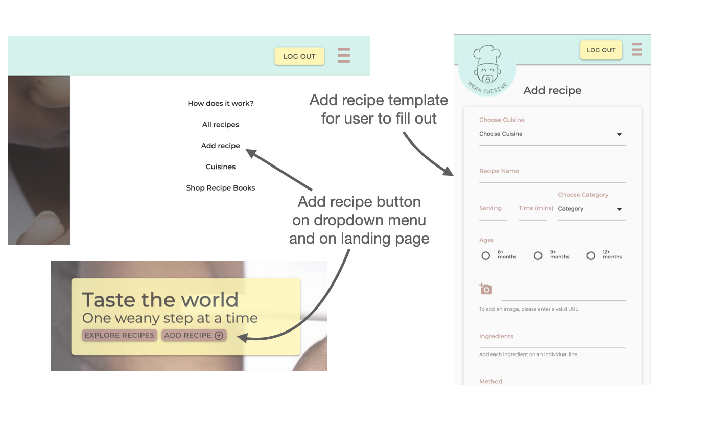

- The edit and delete buttons are only available to the user who created the recipes. These are found on the individual recipe cards and are only visible when the user is logged in.
  - When the user clicks edit they will be directed to the edit page which is the same template as the add recipe page but input fields are already pre-filled with previous input.

  - When the user selects delete they will be presented with a confirmation pop-up to confirm their action.

   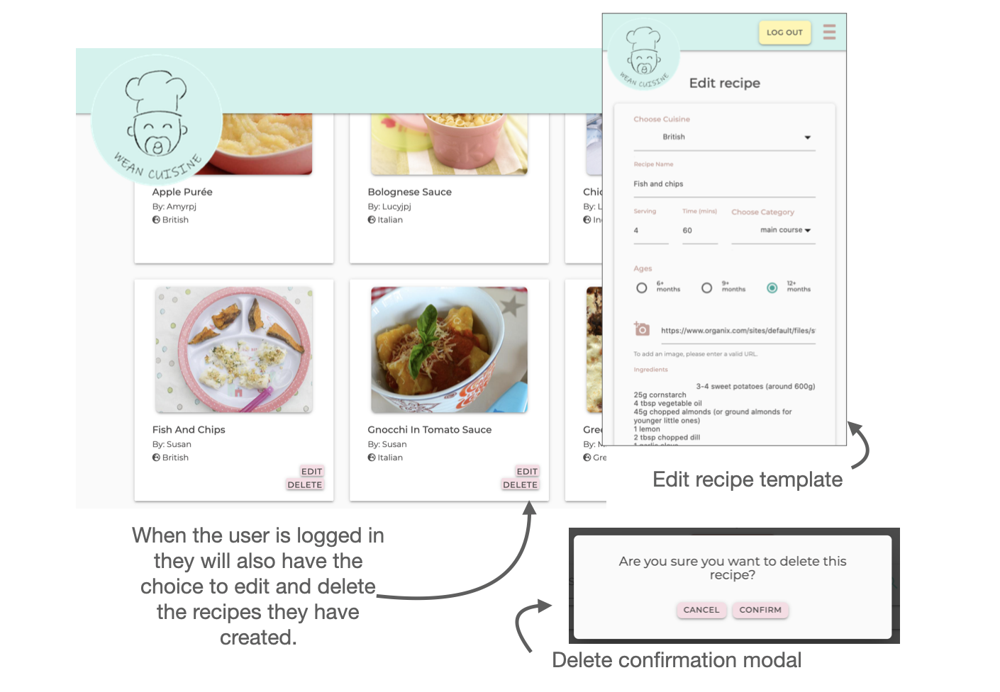

**6. Links for purchasing recipe books for further inspiration**
- Users can access the ‘shop recipe books’ page via a link on the homepage or through the dropdown menu. 

   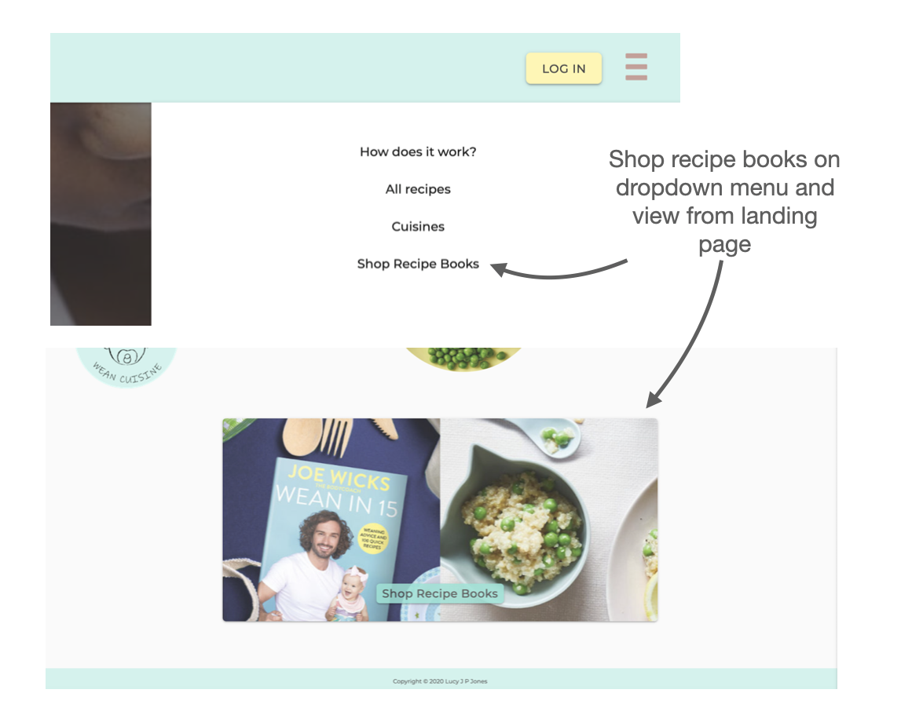

- The 'shop recipe books' page includes cards with the book image and a 'buy' button featuring a dropdown list with links to external retailer sites.
  - When the user clicks on a retailer link, a separate tab is opened for the site.

  

Testing my site owner's <u>key priorities</u>:

**1. When logged in as admin user, have the option to add, update and delete cuisine cards**

- See notes for site member testing point 5 above.

**2. When logged in as admin user, have the option to add, update and delete cuisine cards**

- Admin control over adding, editing, and deleting new cuisines. Buttons only visible when the specified admin is logged in.

  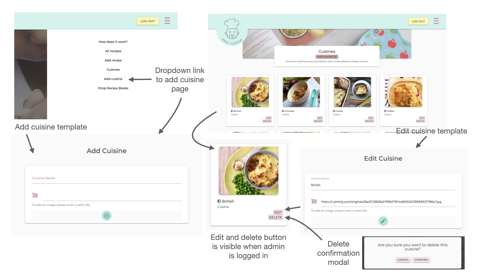

#### Manual function testing

To ensure my site was working correctly I carried out some manual function testing;

**1. Site navigation**

- I checked the site dropdown menu was working correctly by starting on the home-page and navigating around the site from and to every screen the user would be faced with.

- I checked the logo homepage navigation was working by clicking on the brand image from every page.

- 404 Error page was tested by creating a broken link in the game URL and making sure it responded with my custom page.

- The links to recipe book retailers were checked by ensuring that each dropdown link navigated to the correct site opened on a new window. This was tested for every dropdown item.

**2. Hover, focus, and active effects**

- I hovered over every button element to ensure the correct brightness effect was in place.

**3. Log in, register, and logout function**

- To check the login functionality was working I first clicked on the 'login' button to ensure the modal appeared, which it did. When presented with the modal I conducted various checks;
  - I filled out the login form with an already registered username and password then clicked 'Login'. The modal closed, the login button changed to log out and I received a message 'lucyjpj successfully logged in'.
   - I filled out the login form with a new username and password then clicked 'Login'. The modal stayed open and responded with a red flash message 'Incorrect Username and/or password'.

- To check the Register functionality was working I first clicked on the 'login' button to ensure the modal appeared, which it did. Then I located the register tab and conducted some checks;
  - I filled out the registration form with a new username and password then clicked 'Register'. The modal closed, the login button changed to log out and I received a message 'lucyjpj successfully logged in'.

   - I filled out the login form with an already registered username and password then clicked 'Register'. The modal stayed open and responded with a red flash message 'Username already exists, please log in'.
  
- I could also see that after logging in and registering successfully I had additional buttons displayed to me so I knew it was working. The log in modal was tested throughout all pages of the site.

- Once I was logged in and the 'log out' button was available I clicked this to check that it logged me out correctly. The log out button changed to log in, I received a message 'Successfully logged out' and the additional buttons were no longer visible to me so I knew it was working. This was tested throughout all pages of the site.

**4. Form validation checks**

- Login/Register form validation errors;
  - I entered an invalid username into the username field and was displayed with 'Please match the format requested'.
  - I entered an invalid password into the password field and was displayed with 'Please match the format requested'.

- I checked the information tooltips were working by hovering over the information icon.

- I tested the add/edit recipe and cuisine templates by inputting valid and invalid data and checking that I received the correct responses.

**5. Explore recipes and search bar**
- I clicked on the 'Explore recipes' button on the homepage callout section and the link within the dropdown menu, and both correctly navigated to the recipes page. This was checked from all pages of the site.

- After adding my search indexes via the python interpreter I entered 'mongo.db.recipes.index_information()' to check that the correct details had been added. I also checked this by clicking on the 'indexes' section on MongoDB.

- I submitted a selection of words into the recipe search bar to ensure the query function was filtering the recipes correctly, and all worked correctly.

**6. Viewing recipes**
- I clicked on each recipe card to make sure it displayed the correct information to me when navigated to the view recipes HTML template, and it did.

**7. Adding recipe**
- I logged in as a variety of different users to check that the add recipe button was only visible on the homepage and recipes page if a user was logged in.

- I clicked on the 'Add recipe' button on the homepage callout section and the link within the dropdown menu, and both correctly navigated to the add recipe page. This was checked from all pages of the site.

**8. Editing recipe**
- I logged in as a variety of different users to check that the edit button was only visible on the recipes the specific user had added.

- I clicked on the 'Edit' button on the recipe cards to test that I was correctly navigated to the edit recipe page and that the fields were already prefilled with the previous data inputted.

**9. Deleting recipe**
- I logged in as a variety of different users to check that the delete button was only visible on the recipes the specific user had added.

- I clicked on the 'Delete' button on the recipe cards to test that I was correctly presented with a modal for delete confirmation. I then clicked the 'delete' button on the modal and checked if the recipe card had been removed.

**10. Link to cuisine page**
- I clicked on the 'Cuisines' link within the dropdown menu to check that I was correctly navigated to the cuisine page. This was checked from all pages of the site.
  - Once on the cuisine page I clicked on each cuisine card to ensure I was correctly navigated to the recipes page, filtered by the correct cuisine type.

- On the homepage, I clicked on every carousel item to ensure I was directed to the recipes page, filtered by the correct cuisine type.

**11. Adding cuisine**
- I logged in as different users to check that the 'add cuisine' option in the dropdown menu and the 'add cuisine' button on the cuisine page was only visible when the specified admin user was logged in.

- I clicked on 'add cuisine' to ensure that I was directed to the add cuisine page. I then entered the cuisine name and image URL into the form and clicked the submit 'add' icon to check if the new cuisine was added, and it was.

**12. Editing cuisine**

- I logged in as different users to check that the 'edit' button was only visible on the cuisine cards if I was logged in as the specified admin user.

- I clicked on the 'edit' button on various cuisine cards to ensure that I was directed to the edit cuisine page. I then updated the cuisine name and image URL and clicked the submit 'edit' icon to check if the cuisine had been updated, and it was.

**13. Deleting cuisine**
- I logged in as different users to check that the 'Delete' button was only visible on the cuisine cards if I was logged in as the specified admin user.

- I clicked on the 'Delete' button on all the recipe cards to test that I was correctly presented with a modal for delete confirmation. I then clicked the 'Delete' button on the modal and checked if the cuisine card had been removed, it had.

#### Validator checks

The W3C Markup Validator and W3C CSS Validator Services were used to validate every page of the project to ensure there were no syntax errors in the project. The code was entered through direct input. JS hint was used to check for any errors with my Javascript files. 
JS was also tested by opening the developer console window on Chrome and checking for any errors as I clicked through the site.
I used the PEP8 online checking tool to inspect my Python code against the style conventions in PEP 8.

- [**HTML Validator**](https://validator.w3.org/)

  No error or warning messages were received.

- [**CSS Validator**](https://jigsaw.w3.org/css-validator/)

    No error or warning messages were received.

- [**JS hint**](https://jshint.com/)

  

  <u>Warnings received;</u>

  > 'let' is available in ES6 (use 'esversion: 6') or Mozilla JS extensions (use moz).

  Warnings occurred as JShint is using ECMAScript 5.1 specification and my code uses ECMAScript 6 specific syntax. However, all code is valid.

  <u>Undefined variables;</u>

  > $

  $ (Jquery) defined in base.html.

- **Developer tools**

  One error message present in the console: **Fixed**

    

    I found this was a widely discussed error on [stack overflow](https://stackoverflow.com/questions/30693021/chrome-developer-tools-shows-favicon-404-error-in-brackets-livepreview), where the browser looks for a favicon.ico in the root level of a website and if not found generates an error. To avoid any errors being sent to my console, I decided to create my own [Favicon](https://favicon.io/) using my site logo. This not only helped to eliminate my console error but added a personal touch to my website.

  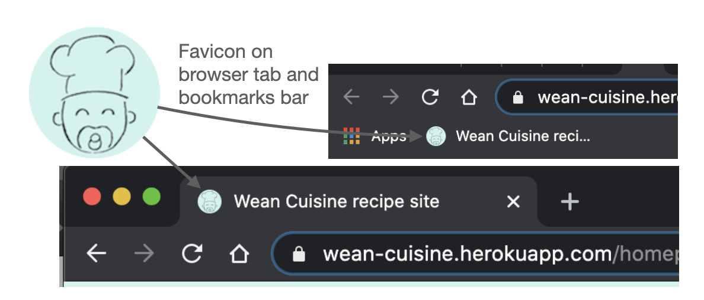  

- [**PEP8 online check**](http://pep8online.com/checkresult)
  
  app.py:

  'All right'

  env.py:

  

   My .gitignore file ignores env.py so the error can be disregarded.

#### Audits

[Lighthouse](https://developers.google.com/web/tools/lighthouse) was used to run a series of audits to improve the quality of web pages. Overall performance and errors are highlighted below.

- To improve performance I added [lazy loading](https://web.dev/browser-level-image-lazy-loading/) to all my images to reduce page weight, allowing for a quicker page load time.

<u>Performance</u>

The low-performance review was mainly driven by the following metrics:

- Properly size images;

  As images are uploaded through the image URL form input I am not able to take any action on adjusting image sizes.

- Serve images in next-gen formats;

  I tried converting my images to JPEG 2000 as suggested, however, the images were not loading due to their limitations of only working on certain browsers. Therefore I have kept my image in a PNG and JPG format.

#### Responsive Design

- Site created as a mobile-first design.

- Viewport tag included in the head of HTML files to tell the browser how to respond to different resolutions, particularly mobile ones.

- Media queries used in the CSS file to target larger devices.

#### Additional Testing

- The Website was tested on Google Chrome, Safari browsers, Firefox, and Edge.

- The website was viewed on a variety of devices including HP Laptop, Macbook pro, Ipad and IPhones (Version 6,7,8,11, 12)

- Friends and family members were asked to review the site to point out any bugs, user experience issues, and/or suggestions.

  - Feedback action:
    - Would like the site to include dietary requirements- this is included in my future development plans.

- Project posted on Slack, asking for feedback from fellow students.

#### Bugs

|     | Bug                                                                           | Action                                                            |
|-----|-------------------------------------------------------------------------------|-------------------------------------------------------------------|
| [X] | Materialize select not working correctly on iPhone                     | I found that this is a [known issue](https://github.com/Dogfalo/materialize/issues/6464) with Materialize select not working correctly on new iOS. I found a temporary solution on GitHub, and added the code to [select.js](https://github.com/Dogfalo/materialize/blob/c0da34049deec36efbd4681f73b3446e92918ca8/js/select.js) which has fixed the bug  |
| [ ] | Materialize dropdown menu is out of sync when selecting links                    | I found that this is a [known issue](https://github.com/Dogfalo/materialize/issues/6464) with materialize dropdown not working correctly on new iOS, but there is not yet a solution available for this bug |
| [ ] | Materialize select showing browser default arrow on iPhone                    | Known issue with iOS, doesn't affect the functionality for the user but I will continue to seek a solution  |